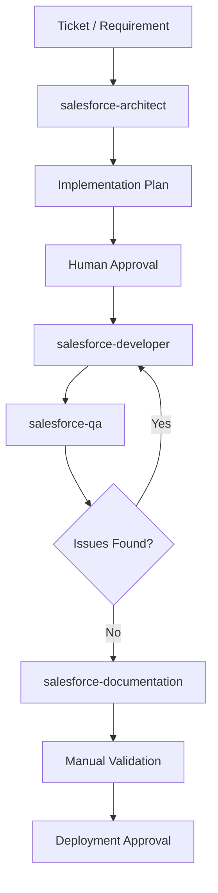

# Salesforce MCP Agentic Delivery Workflow

This document describes the reusable MVP workflow for Salesforce delivery using Codex, Salesforce DX MCP, agents, and skills.

## Architecture



## Default MVP rules

- Start every ticket in PLAN MODE.
- Use MCP for relevant Salesforce discovery only.
- Do not modify files before approval.
- Do not deploy before approval.
- Keep implementation small and reviewable.
- Produce documentation before closing the ticket.

## Agent responsibilities

### salesforce-architect

Creates the implementation plan.

### salesforce-developer

Implements approved changes.

### salesforce-qa

Validates acceptance criteria, tests, and edge cases.

### salesforce-documentation

Creates UAT, deployment, rollback, and release documentation.

## Recommended prompt flow

### Step 1 — Architect

```text
Use salesforce-architect.
Analyze this ticket in PLAN MODE.
Do not modify files. Do not deploy. Use MCP only for relevant discovery.

Ticket:
[PASTE TICKET]
```

### Step 2 — Developer

```text
Use salesforce-developer.
ACT MODE approved.
Implement the approved plan for ticket [TICKET-ID].
Do not deploy.
```

### Step 3 — QA

```text
Use salesforce-qa.
Validate the implementation for ticket [TICKET-ID].
Do not modify files. Do not deploy.
```

### Step 4 — Documentation

```text
Use salesforce-documentation.
Prepare delivery documentation for ticket [TICKET-ID].
Include UAT, deployment notes, rollback, and release notes.
```
